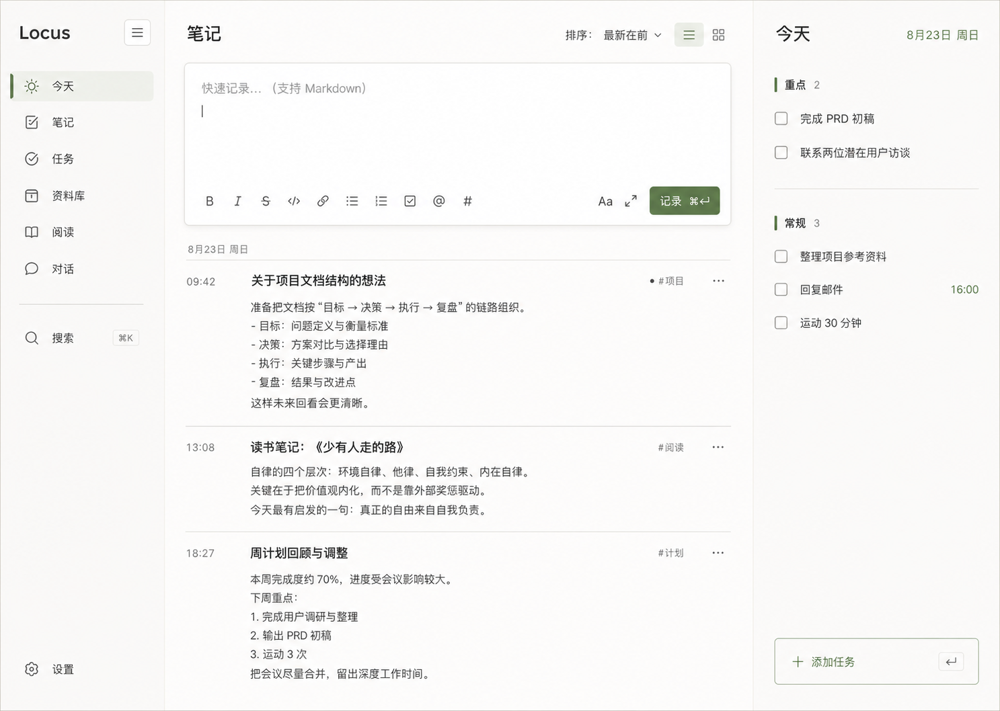

# Locus Desk：Rust + Svelte 5 个人支持库产品与技术设计方案

> 文档状态：持续维护（Living Document）
>
> 当前阶段：Phase 0B — 完成，Phase 1/2 待选择
>
> 文档版本：0.9
>
> 最近更新：2026-08-24
>
> 产品名称：Locus Desk

## 1. 摘要

本文设计一个受 Memos 启发、但完全重新实现的自托管个人支持库。首日目标不是复刻 Memos，而是交付两个最常用的闭环：Markdown 快速 Memo，以及常驻的全部未完成 Todo 管理。

长期目标是在同一套本地优先的数据与搜索底座上，逐步加入网页剪藏和稍后阅读、RSS 阅读器、任务增强，以及能够连接这些知识与行动的 Agent Chat。产品不是五个孤立工具的集合，而是一条统一的信息工作流：采集、整理、阅读、行动、检索和对话。

新应用采用 Rust + Axum + SQLite 后端和 Svelte 5 + Vite 前端。前端编译为纯静态资源，并嵌入 Rust 二进制中；生产环境只需一个可执行文件和一个数据目录，不依赖 Node.js，也不运行独立前端服务。

首版明确不兼容 Memos API、数据库或导出格式，不实现导入工具。现有 Memos 仓库仅用于产品和实现方式调研，新应用应在独立仓库中开发。为了避免后续扩展时推翻首版，Memos + Todo MVP 从第一天使用稳定的对外 ID、版本化 API 和可独立演进的领域边界。

产品和所有用户可见文案统一使用 **Memos**，不再使用 Notes。已有数据库表、HTTP 路由和代码类型继续保留 `notes`、`Note` 等内部实现名，除非后续重构能带来明确收益；这些内部标识不构成产品术语。

这是一个以个人使用和学习新技术为主要目的的全新项目。开发期间不承担历史版本、旧数据库、旧 API 或外部客户端兼容责任；模型和接口不合理时可以直接重构。技术选型优先采用实现时最新的成熟稳定版本，而不是为了兼容旧环境停留在过时方案。同时，数据访问从第一天携带 workspace 边界，为未来邀请少量好友、按个人空间隔离数据保留低成本扩展路径，但首版不实现多租户管理界面。

## 2. 调研结论

### 2.1 Memos 的核心价值

从当前 Memos 的 README、首页、编辑器、Memo API 和 SQLite 数据模型来看，它的核心价值并不是复杂的知识管理，而是以下组合：

1. **低摩擦记录**：进入首页即可输入，不需要先选笔记本、目录或模板。
2. **时间流组织**：Memo 按时间倒序呈现，记录完成后自然沉入历史。
3. **Markdown 原生**：内容是可迁移的纯文本，同时支持常见富文本表达。
4. **轻量整理**：标签、置顶、归档和搜索足以覆盖大多数个人整理需求。
5. **自托管与数据所有权**：单服务部署，数据由用户掌握。

因此，新应用的首版应保留“首页即编辑器 + 时间流”的产品骨架，而不是从文件夹、页面树或完整知识库开始。

### 2.2 功能分层

| 层级 | 功能 | 结论 |
| --- | --- | --- |
| Phase 0A 核心 | 登录、Markdown CRUD、时间流、基础搜索、Todo CRUD、单二进制 | 当日必须交付 |
| Phase 0B 完整 MVP | 置顶、归档、标签、Tasks 页面、数据导出/备份、快捷键 | 开始长期自用前完成 |
| 后续增强 | 附件、公开分享、主题、网页剪藏、RSS、Agent | 由阶段门禁推进 |
| 非目标 | 多用户、评论、反应、通知、地图、SSO、外部存储、多数据库 | 不进入当前设计 |
| 兼容性 | Memos API、历史数据库、旧版内部 API、导入迁移 | 明确不支持，也不承诺开发期稳定性 |

### 2.3 目标用户与核心任务

当前目标用户就是项目作者本人：在个人电脑、家庭服务器或 VPS 上部署轻量记录工具。未来可能邀请少量好友，每个人默认拥有独立 workspace。

核心任务是：

- 想法出现时，在几秒内写下并保存 Memo。
- 通过时间流回顾最近的 Memos。
- 通过关键词或标签找回历史内容。
- 用置顶保存近期重点，用归档收起不再活跃的 Memos。
- 快速添加待办事项，勾选完成，并按重点和常规分组浏览全部未完成任务。
- 保证数据重启不丢失，并能用一个服务进程长期运行。

### 2.4 项目性质与工程原则

- **个人使用优先**：所有产品决策首先优化作者本人的工作整理和学习体验，不为假想企业客户增加流程。
- **绿色开发**：不兼容 Memos 或任何历史版本；开发期允许直接修改 schema、删除 API 和重建本地测试数据。
- **最新成熟技术**：使用实现时最新 stable 工具链和主流稳定版本，不使用 nightly 或只有实验性支持的关键依赖。
- **锁定可复现构建**：提交 `Cargo.lock` 和 `pnpm-lock.yaml`，升级依赖时通过测试和构建验证，而不是追逐每个即时版本。
- **模块化单体**：为学习保留清晰领域边界，但不为了展示架构而拆微服务、消息总线或独立数据库。
- **workspace-aware**：首版只有一个用户和一个个人 workspace，但所有业务查询显式接收 workspace ID，避免未来多租户改造时重新检查每条数据路径。
- **允许破坏性重构**：`/api/v1` 在产品对外稳定发布前只是路由命名空间，不构成兼容承诺；必要时可以直接改变请求、响应和语义。
- **区分代码兼容与个人数据安全**：开始存放真实个人数据前可以直接重建数据库；投入日常使用后仍可做破坏性代码/API 变更，但 schema 调整必须提供单向迁移并在升级前备份，不要求旧程序继续读取新库或支持回滚。

## 3. Phase 0 产品范围

### 3.1 用户旅程

1. 所有者设置启动环境变量并启动应用。
2. 空数据库在启动时自动创建第一个用户和个人 workspace。
3. 浏览器访问服务，未登录时进入登录页。
4. 登录后进入首页，焦点可直接进入编辑器。
5. 输入 Markdown 并提交，新 Memo 立即出现在时间流顶部。
6. 用户在右侧 Todo 栏添加、完成和整理全部未完成任务。
7. 用户可搜索、按标签筛选、编辑、置顶、归档或删除 Memo。
8. 服务重启后，账户、workspace、Memos 和任务数据完整保留。

### 3.2 功能范围与优先级

Phase 0A 是今天必须形成的可运行核心：

- 单所有者用户名和密码登录。
- Markdown Memo 新建、读取、编辑、删除。
- 首页倒序时间流。
- Todo 任务的新建、编辑、完成、恢复和删除。
- 任务的重点/常规分组、日期，以及可选时间。
- 参数化 `LIKE` 基础搜索，先保证中英文可用。
- 基本 Markdown 渲染，包括标题、列表、任务列表、引用、链接和代码块。
- 桌面端双轨工作台；窄屏只保证不破坏数据操作，不做完整移动端适配。
- 加载、空列表、提交中和错误状态。
- 单二进制生产构建。

Phase 0B 在核心可运行后补齐完整 MVP：

- 置顶与取消置顶。
- 归档列表和恢复归档。
- 从 Markdown 内容自动提取 `#tag` 标签并支持筛选。
- 独立 Tasks 页面。
- JSON/Markdown 导出、SQLite 在线备份、升级前自动备份和恢复演练。
- 更完整的自动化测试、键盘操作和错误反馈。

Phase 0 不实现：

- 用户注册、多个用户或权限分级。
- 图片和文件附件。
- 公开页面或分享链接。
- 评论、反应、通知和收件箱。
- Memo 关系、反向链接、地图和定位。
- 任务项目、复杂重复规则、日历、习惯、番茄钟、提醒推送和拖拽排序。
- 第三方登录、API Token 和开放 API 兼容。
- MySQL、PostgreSQL 或远程对象存储。
- Memos 数据导入、数据库迁移或 API 兼容层。

### 3.3 产品交互原则

- 首页编辑器始终位于时间流之前，登录后无需额外导航即可记录。
- 默认只展示正常状态的 Memos，归档内容进入独立页面。
- 默认排序为置顶优先，其余按创建时间倒序。
- 编辑采用原位编辑或紧邻卡片的编辑状态，避免跳转到复杂详情页。
- 删除必须二次确认；归档和置顶可以直接操作并提供即时反馈。
- 创建成功后清空编辑器，将新 Memo 插入列表顶部，不等待完整列表刷新。
- 编辑、置顶和归档可以使用乐观更新，失败时必须回滚并显示明确错误。
- Todo 右栏展示全部未完成任务，支持直接添加和勾选；完成后任务从 Todo 移除，但仍可在完整 Tasks 页恢复。
- Todo 快速添加默认不设置日期，因此同时属于 Inbox；用户可以按需设置日期和可选时间。未来 Today、Upcoming 等日期视图不改变 Todo 的“全部未完成”语义。
- Memo 中的 Markdown checkbox 不与任务表双向同步；首版两者保持清晰边界。

## 4. 技术架构

### 4.1 总体结构

```text
Browser
  │
  ├── /api/* ───────────────▶ Axum JSON API
  │                              │
  │                              ├── Auth / Session
  │                              ├── Note Service
  │                              ├── Task Service
  │                              └── SQLx ──▶ SQLite
  │
  └── /* ────────────────────▶ Embedded Svelte Assets
                                 └── SPA index.html fallback
```

建议的新应用仓库结构：

```text
app/
├── Cargo.toml
├── Cargo.lock
├── migrations/
├── src/
│   ├── api/
│   │   ├── auth.rs
│   │   ├── notes.rs
│   │   ├── tasks.rs
│   │   └── mod.rs
│   ├── auth/
│   ├── db/
│   ├── workspace/
│   ├── config.rs
│   ├── error.rs
│   ├── static_files.rs
│   └── main.rs
└── web/
    ├── package.json
    ├── vite.config.ts
    └── src/
        ├── lib/
        ├── routes/
        ├── components/
        ├── App.svelte
        └── main.ts
```

### 4.2 后端选型

| 领域 | 选型 | 理由 |
| --- | --- | --- |
| Rust 工具链 | 实现时最新 stable、Edition 2024 | 个人学习项目无需兼容旧编译器 |
| 异步运行时 | 最新稳定 Tokio | Axum 和 SQLx 的主流组合 |
| HTTP 框架 | 最新稳定 Axum | 路由、提取器、中间件和共享状态足够直接 |
| 数据库 | SQLite | 个人和小规模好友场景无需独立数据库服务 |
| 数据访问 | 最新稳定 SQLx | 异步连接池、事务和内嵌迁移支持完整 |
| 序列化 | Serde | Rust JSON 标准方案 |
| 密码 | Argon2id | 只保存加盐密码哈希 |
| 日志 | tracing | 结构化日志，便于部署排查 |
| 静态资源 | rust-embed | 将 Vite 构建产物编译进单个二进制 |

SQLx 查询首版使用运行时 `query`/`query_as`，避免构建时依赖 `DATABASE_URL` 或维护离线查询元数据。迁移通过 `sqlx::migrate!()` 嵌入二进制。

依赖版本不在本文写死。创建新仓库时解析当日最新 stable 版本并提交锁文件；后续可以进行破坏性升级，只要求升级提交同时完成 schema、代码和测试调整。

SQLite 启动参数：

- 启用 foreign keys。
- 使用 WAL journal mode。
- 配置 busy timeout，降低短时写锁导致的失败。
- 使用小连接池；个人和少量好友场景不需要大量连接。

### 4.3 前端选型

| 领域 | 选型 | 理由 |
| --- | --- | --- |
| UI | 最新稳定 Svelte 5 | 编译产物轻，适合小型 SPA |
| 构建 | 最新稳定 Vite | 开发反馈快，可直接输出静态目录 |
| 语言 | 最新稳定 TypeScript | 固定 API 类型和组件契约 |
| 状态 | Svelte 5 runes | 使用 `$state`、`$derived`、`$props`，无需额外状态库 |
| Markdown | GFM 解析器 + DOMPurify | 支持常用语法并防止存储型 XSS |
| 样式 | 原生 CSS + 设计令牌 | 减少 Phase 0 依赖和配置成本 |
| 图标 | lucide-svelte（可选） | 图标一致且依赖较轻 |

首版不引入 SvelteKit、Tailwind、完整 UI 组件库或查询缓存框架。API 客户端基于 `fetch` 封装，页面状态由小型 Svelte 状态模块管理。

### 4.4 开发与生产模式

开发模式：

- Axum 监听 `127.0.0.1:7310`。
- Vite 监听独立开发端口，并将 `/api` 代理到 Axum。
- 前后端分别热更新。

生产模式：

1. 在 `web/` 执行 `pnpm build`，生成 `web/dist`。
2. 执行 `cargo build --release`。
3. `rust-embed` 将 `web/dist` 编译进二进制。
4. Axum 同时提供 API 和静态资源。

路由规则：

- `/api/*` 只进入 API Router，未知接口返回 JSON 404；业务接口从第一天固定使用 `/api/v1` 前缀。
- 存在的静态文件直接返回，并设置正确 MIME 类型。
- 非 API 且不带文件扩展名的未知路径返回 `index.html`，支持 SPA 刷新。
- 带内容哈希的资源设置长期不可变缓存；`index.html` 设置 `no-cache`。

### 4.5 技术演进策略

- 新功能直接使用当前稳定框架推荐写法，不维护旧 Axum、SQLx、Svelte 或 TypeScript 版本的兼容层。
- 升级可以修改内部模块、API、数据库和前端状态结构，不设置长期 deprecation 周期。
- 不为了潜在替换而给 Axum、SQLx 或 SQLite 再包一套通用框架；领域服务和测试边界就是主要隔离层。
- 关键依赖必须有活跃维护、稳定发布和足够社区使用；学习新技术不等于把实验性组件放到持久化、认证或安全关键路径。
- 依赖升级以一次完整提交完成：更新锁文件、修复代码、运行测试、验证生产构建，并在真实数据环境升级前备份。
- 项目投入日常使用后只支持“最新代码 + 最新 schema”，不承诺旧二进制、旧前端或旧 API 客户端继续工作。

## 5. 数据设计

### 5.1 用户与 Workspace

```sql
CREATE TABLE users (
  id            INTEGER PRIMARY KEY AUTOINCREMENT,
  uid           TEXT NOT NULL UNIQUE,
  username      TEXT NOT NULL UNIQUE,
  password_hash TEXT NOT NULL,
  created_at    INTEGER NOT NULL,
  updated_at    INTEGER NOT NULL
);

CREATE TABLE workspaces (
  id         INTEGER PRIMARY KEY AUTOINCREMENT,
  uid        TEXT NOT NULL UNIQUE,
  name       TEXT NOT NULL,
  timezone   TEXT NOT NULL,
  created_by INTEGER NOT NULL,
  created_at INTEGER NOT NULL,
  updated_at INTEGER NOT NULL,
  FOREIGN KEY (created_by) REFERENCES users(id)
);

CREATE TABLE workspace_members (
  workspace_id INTEGER NOT NULL,
  user_id      INTEGER NOT NULL,
  role         TEXT NOT NULL CHECK (role IN ('OWNER', 'ADMIN', 'MEMBER')),
  created_at   INTEGER NOT NULL,
  PRIMARY KEY (workspace_id, user_id),
  FOREIGN KEY (workspace_id) REFERENCES workspaces(id) ON DELETE CASCADE,
  FOREIGN KEY (user_id) REFERENCES users(id) ON DELETE CASCADE
);
```

首版产品行为仍然是单用户：空数据库首次启动时必须提供：

- `APP_ADMIN_USERNAME`
- `APP_ADMIN_PASSWORD`

服务将密码转换为 Argon2id 哈希后创建第一个用户、一个默认个人 workspace，以及对应的 `OWNER` membership，绝不保存或记录原始密码。系统已经初始化时忽略上述初始化值，并记录不包含敏感信息的提示日志。

`workspaces.timezone` 保存 IANA 时区，例如 `Asia/Singapore`。初始化时从 `APP_TIMEZONE` 写入；“今天”、逾期、完成于今天等业务日期统一由后端按 workspace 时区计算，不能依赖浏览器、服务器操作系统或数据库连接的本地时区。

首版不提供注册、邀请、workspace 创建或切换 UI。保留这些表的目的只是让 Memos、Tasks、Library 等领域从一开始拥有明确租户边界，而不是提前实现完整多租户产品。未来每位好友可以拥有自己的个人 workspace，也可以通过 membership 加入共享 workspace。

### 5.2 会话

```sql
CREATE TABLE sessions (
  token_hash          TEXT PRIMARY KEY,
  user_id             INTEGER NOT NULL,
  active_workspace_id INTEGER NOT NULL,
  created_at          INTEGER NOT NULL,
  expires_at          INTEGER NOT NULL,
  FOREIGN KEY (user_id) REFERENCES users(id) ON DELETE CASCADE,
  FOREIGN KEY (active_workspace_id) REFERENCES workspaces(id) ON DELETE CASCADE
);
```

- 登录成功后生成至少 256 bit 的随机令牌。
- 数据库只保存令牌的 SHA-256 摘要。
- 原始令牌放入 `HttpOnly`、`SameSite=Lax` Cookie。
- HTTPS 部署时启用 `Secure`，通过配置显式控制本地 HTTP 场景。
- 默认有效期 30 天；每次认证都检查过期时间。
- 登出删除当前会话；启动时可顺便清理过期会话。

### 5.3 Memos

```sql
CREATE TABLE notes (
  id           INTEGER PRIMARY KEY AUTOINCREMENT,
  uid          TEXT NOT NULL UNIQUE,
  workspace_id INTEGER NOT NULL,
  creator_id   INTEGER NOT NULL,
  content      TEXT NOT NULL,
  status       TEXT NOT NULL CHECK (status IN ('ACTIVE', 'ARCHIVED')) DEFAULT 'ACTIVE',
  pinned       INTEGER NOT NULL CHECK (pinned IN (0, 1)) DEFAULT 0,
  created_at   INTEGER NOT NULL,
  updated_at   INTEGER NOT NULL,
  FOREIGN KEY (workspace_id) REFERENCES workspaces(id) ON DELETE CASCADE,
  FOREIGN KEY (creator_id) REFERENCES users(id)
);

CREATE INDEX idx_notes_status_order
  ON notes(workspace_id, status, pinned DESC, created_at DESC, id DESC);
```

`id` 是只在数据库内部使用的整数主键；`uid` 使用 ULID，是 API、URL、关系和未来浏览器插件使用的稳定标识。API 不暴露内部整数 ID。所有时间戳使用 UTC Unix 毫秒。

首版硬删除 Memo，不增加软删除状态。删除前由前端明确确认。

### 5.4 标签与搜索

```sql
CREATE TABLE note_tags (
  note_id INTEGER NOT NULL,
  tag     TEXT NOT NULL,
  PRIMARY KEY (note_id, tag),
  FOREIGN KEY (note_id) REFERENCES notes(id) ON DELETE CASCADE
);

CREATE INDEX idx_note_tags_tag ON note_tags(tag);
```

标签由独立的领域服务在创建和更新 Memo 时从 Markdown 内容中提取，统一去除 `#`、去重并按约定规则规范化。HTTP handler 不直接实现标签解析。更新 Memo 时，在同一事务中替换该 Memo 的全部标签。

Phase 0A 先使用带 workspace 条件的参数化 `LIKE` 搜索。个人数据量小时，它的实现和中文行为更可预测。真实中英文样本评估作为长期使用中的持续验证，再决定是否引入 SQLite FTS5；该评估不阻塞后续功能开发，但不能因为英文测试通过就默认中文检索质量合格。

如果启用 FTS5，通过迁移中的触发器与 `notes` 同步，FTS 文档必须携带可过滤的 workspace 标识，搜索查询先绑定当前 workspace，再返回对象。API 形状不依赖具体索引实现。

### 5.5 Phase 0 任务

```sql
CREATE TABLE tasks (
  id           INTEGER PRIMARY KEY AUTOINCREMENT,
  uid          TEXT NOT NULL UNIQUE,
  workspace_id INTEGER NOT NULL,
  creator_id   INTEGER NOT NULL,
  title        TEXT NOT NULL,
  description  TEXT NOT NULL DEFAULT '',
  status       TEXT NOT NULL CHECK (status IN ('TODO', 'DONE')) DEFAULT 'TODO',
  priority     INTEGER NOT NULL CHECK (priority BETWEEN 0 AND 1) DEFAULT 0,
  due_date     TEXT,
  due_time     TEXT,
  sort_key     INTEGER NOT NULL DEFAULT 0,
  completed_at INTEGER,
  created_at   INTEGER NOT NULL,
  updated_at   INTEGER NOT NULL,
  FOREIGN KEY (workspace_id) REFERENCES workspaces(id) ON DELETE CASCADE,
  FOREIGN KEY (creator_id) REFERENCES users(id),
  CHECK (due_time IS NULL OR due_date IS NOT NULL)
);

CREATE INDEX idx_tasks_today
  ON tasks(workspace_id, status, due_date, priority DESC, sort_key ASC, created_at ASC);
```

- `uid` 使用 ULID，对外不暴露内部整数 ID。
- `priority=1` 表示重点，`priority=0` 表示常规；Phase 0 不设计多级优先级系统。
- `due_date` 使用严格校验的 `YYYY-MM-DD`，表达“哪一天做”；`due_time` 使用 `HH:mm`，仅表达该日内的可选时间，二者都不做隐式 UTC 换算。
- Todo 快速添加默认不写入 `due_date`，因此新任务同时属于 Inbox；Todo 仍展示全部未完成任务。`due_date` 仅表示用户选择的计划日期，供日期标签和后续 Today/Upcoming 视图使用。
- `sort_key` 为同一分组内的稳定手工排序预留。Phase 0 不提供拖拽，但所有查询都带上该字段作为排序条件，后续无需改变任务模型。
- 设置 `status=DONE` 时同时写入 `completed_at`；恢复时清空该字段。
- `completed_at`、`created_at` 和 `updated_at` 仍使用 UTC Unix 毫秒；只有任务的计划日期与可选钟点采用日历值。
- Phase 0 不实现项目、重复规则、提醒、子任务和任务依赖。
- Markdown task list 仍属于 Memo 内容，不与 `tasks` 自动同步。

### 5.6 Workspace 隔离约束

- 认证中间件从 session 解析 `user_id` 和 `active_workspace_id`，生成不可由客户端直接伪造的 `RequestContext`。
- Memo、Task 和未来 Library/RSS 服务的方法都必须显式接收 `workspace_id`；不得提供无 workspace 条件的列表、更新或删除方法。
- 查询对象详情时同时匹配 `uid` 与 `workspace_id`，不能先按 UID 读取再在 handler 中补做权限判断。
- 创建对象时 `creator_id` 来自登录态，不接受客户端传入。
- 首版 API 不暴露 workspace 切换参数，因为只有一个个人 workspace；未来增加好友场景时再开放 workspace 列表、邀请和切换接口。
- 测试层从第一天建立两个 workspace 的隔离用例，确保跨 workspace 的 UID 访问返回 404。
- SQLite 足够支持个人和少量好友场景；只有真实并发或运维需求出现时才评估 PostgreSQL，不提前抽象多数据库兼容层。

## 6. HTTP API

API 成功响应除 `204 No Content` 外使用 JSON，错误响应统一使用 JSON。除健康检查、初始化状态和登录接口外，其余 API 都要求有效会话，并在服务端绑定到 session 的 active workspace。`/api/v1` 是清晰的路由命名空间，不代表开发期兼容承诺。所有 `/api` 响应都带 `Cache-Control: no-store`，避免浏览器或中间缓存保存个人数据。

### 6.1 路由

```text
GET    /api/v1/health
GET    /api/v1/bootstrap/status

POST   /api/v1/auth/login
POST   /api/v1/auth/logout
GET    /api/v1/auth/me

GET    /api/v1/notes?status=&q=&tag=&page=&page_size=
POST   /api/v1/notes
GET    /api/v1/notes/:uid
PATCH  /api/v1/notes/:uid
DELETE /api/v1/notes/:uid

GET    /api/v1/tags

GET    /api/v1/tasks?scope=today&status=
POST   /api/v1/tasks
GET    /api/v1/tasks/:uid
PATCH  /api/v1/tasks/:uid
DELETE /api/v1/tasks/:uid
```

### 6.2 主要类型

```ts
type NoteStatus = "ACTIVE" | "ARCHIVED";

interface HealthResponse {
  status: "ok";
  service: "locus-desk";
  version: string;
  gitCommit: string;
  schemaVersion: number;
}

interface BootstrapStatusResponse {
  initialized: boolean;
}

interface SessionInfo {
  user: {
    uid: string;
    username: string;
  };
  workspace: {
    uid: string;
    name: string;
    timezone: string;
    today: string;
    role: "OWNER" | "ADMIN" | "MEMBER";
  };
}

interface Note {
  uid: string;
  content: string;
  status: NoteStatus;
  pinned: boolean;
  tags: string[];
  createdAt: string;
  updatedAt: string;
}

interface CreateNoteRequest {
  content: string;
}

interface UpdateNoteRequest {
  content?: string;
  status?: NoteStatus;
  pinned?: boolean;
}

interface ListNotesResponse {
  items: Note[];
  page: number;
  pageSize: number;
  total: number;
}

interface ListTagsResponse {
  items: string[];
}

type TaskStatus = "TODO" | "DONE";

interface Task {
  uid: string;
  title: string;
  description: string;
  status: TaskStatus;
  priority: 0 | 1;
  dueDate: string | null;
  dueTime: string | null;
  sortKey: number;
  completedAt: string | null;
  createdAt: string;
  updatedAt: string;
}

interface CreateTaskRequest {
  title: string;
  description?: string;
  priority?: 0 | 1;
  dueDate?: string;
  dueTime?: string;
}

interface UpdateTaskRequest {
  title?: string;
  description?: string;
  status?: TaskStatus;
  priority?: 0 | 1;
  dueDate?: string | null;
  dueTime?: string | null;
  sortKey?: number;
}

interface ListTasksResponse {
  items: Task[];
}

interface ApiError {
  error: {
    code: string;
    message: string;
  };
}
```

### 6.3 行为约束

- 创建和更新时，`content.trim()` 不得为空。
- 限制单条 Memo 最大字节数，默认 256 KiB。
- `page_size` 默认 30，最大 100。
- `status` 默认 `ACTIVE`。
- 列表默认按 `pinned DESC, created_at DESC, id DESC` 排序。
- `q` 和 `tag` 可以同时使用，语义为交集。
- PATCH 至少包含一个允许更新的字段，未知字段拒绝处理。
- 任务 `title.trim()` 不得为空，默认最大 500 个 Unicode 字符。
- Todo 右栏通过 `status=TODO` 获取全部未完成任务，不设置日期范围；完成任务后立即从 Todo 移除，并可在完整 Tasks 页恢复。
- `scope=today` 作为日期视图能力保留：返回逾期或计划在今天的未完成任务，以及按 workspace 时区计算为今天完成的任务；它不是 Phase 0 首页右栏的默认范围。
- `SessionInfo.workspace.today` 是服务端按 workspace 时区计算的 `YYYY-MM-DD`，用于日期标签、逾期判断和后续 Today 视图；workspace 日期跨日或页面重新获得焦点时刷新会话信息。无日期任务属于 Inbox，同时仍显示在 Todo。
- 不向客户端暴露数据库错误、密码哈希、会话摘要或内部路径。
- 客户端不能提交 `workspaceId` 或 `creatorId` 覆盖服务端上下文；未来多 workspace 接口应通过受认证的 workspace 切换能力单独设计。
- 登录成功和 `GET /auth/me` 直接返回 `SessionInfo`；`GET /notes` 返回 `ListNotesResponse`，`GET /tags` 返回 `{ items: string[] }`，`GET /tasks` 返回 `{ items: Task[] }`。创建和单项查询/更新直接返回对应的 `Note` 或 `Task`。
- 每个请求由服务端设置或透传 `X-Request-Id`；结构化日志记录 request ID、HTTP 方法、路径、状态码和耗时，不记录 Cookie、密码或完整正文。

状态码约定：

| 状态码 | 场景 |
| --- | --- |
| 200 | 查询或更新成功 |
| 201 | 创建成功 |
| 204 | 登出或删除成功 |
| 400 | 参数格式错误 |
| 401 | 未登录、登录失败或会话过期 |
| 403 | 修改请求的 `Origin` 与 `Host` 不同源 |
| 404 | 资源不存在 |
| 405 | 已知 API 路由不支持该 HTTP 方法 |
| 422 | 内容为空、过长或业务校验失败 |
| 429 | 登录失败次数触发进程内限速 |
| 500 | 未预期服务端错误 |

## 7. 前端设计

### 7.1 已选视觉方向：双轨工作台

用户已从三套桌面端视觉探索中选定“双轨工作台”作为首版基线。它不把 Todo 和 Memos 融成一种数据，而是在同一个日常工作面中并列呈现两条最高频工作流：中央负责快速记录和回看，右侧负责全部未完成行动。



设计稿保留了早期的 Today 文案，仅作为布局和视觉方向参考；当前实现与产品语义以右侧全部未完成 Todo 为准。

桌面端结构固定为：

- **左侧导航约 208–224px**：品牌、Workspace、Memos、Tasks、Archive 和 Search；未来模块在实际交付时加入。当前模块用低饱和强调底色标识。
- **中央 Memos 主工作区**：顶部是可立即输入的 Markdown 编辑器，下方是按日期分组的 Memo 时间流。正文优先，元数据与操作降级。
- **右侧 Todo 任务栏约 320–360px**：按重点和常规分组显示全部未完成任务，支持勾选、日期、时间和快速添加。
- **Memos 搜索**：从左侧入口或 `Ctrl/Cmd + K` 进入 Memos 专注页并聚焦搜索框；跨模块全局搜索留到 Phase 4。

该方向的关键取舍：

- Memos 仍是页面主角，Todo 常驻但不抢占正文宽度。
- 左侧导航确保未来知识库、RSS 和 Chat 可以直接切换，不需要重做壳层。
- 主要内容使用列表和分隔线，不给每条 Memo 和任务套独立卡片。
- Todo 右栏在宽屏常驻；窗口较窄时改为抽屉，不压缩 Memos 到不可读宽度。
- 设计稿中的 `Locus` 已正式确定为产品名称 `Locus Desk`；界面可根据空间保留完整名或使用 `Locus` 简写。

### 7.2 视觉命题

> 一间安静、克制的数字书房：有纸张的温度、编辑工具的精度，以及长期阅读所需的低干扰感。

界面采用 **Calm Editorial Utility** 风格，即“编辑阅读感 + 工具效率感”：

- 温暖的中性底色代替纯白，减少长时间阅读疲劳。
- 深墨色文字建立清晰层级，苔绿色作为唯一主强调色。
- 依靠留白、排版、分隔线和对齐建立结构，不用卡片矩阵堆砌模块。
- 日常界面不使用装饰渐变、玻璃拟态、厚重阴影和大量圆角胶囊。
- Memos 保持轻和快；Library 更偏编辑阅读；Tasks 更紧凑；Reader 更沉浸；Chat 更专注于来源与行动。

产品应像一个持续积累的个人工作空间，不像企业管理后台，也不照搬 Notion 式文档画布。

### 7.3 内容计划

Phase 0 双轨工作台的视觉优先级固定为：

1. **记录**：编辑器是首页最重要的主操作。
2. **行动**：全部未完成 Todo 常驻右栏，添加和完成不需要切换页面。
3. **找回**：搜索和标签提供快速缩小范围的能力。
4. **浏览与整理**：时间流展示最近内容，置顶、归档和删除按需出现。

长期模块沿用同一壳层，但每个页面只有一个主工作区：Library 的主角是文章与阅读状态，Tasks 的主角是行动列表，Reader 的主角是未读流，Chat 的主角是对话和引用。

### 7.4 交互命题

动效只用于表达状态变化和空间关系：

1. 编辑器获得焦点时轻微展开，保存成功后新 Memo 从编辑器下方进入时间流。
2. 置顶、归档和过滤使用短暂的布局过渡，让用户看懂内容去了哪里。
3. Chat 的来源引用和 Library 的阅读上下文通过侧栏或抽屉平滑出现，不打断主内容。

所有常规动效控制在 120–220ms；只使用透明度、位移、尺寸和背景色变化，不使用弹跳或大幅缩放。系统启用 `prefers-reduced-motion` 时取消非必要动画。

### 7.5 页面

首版包含五个页面：

- `/login`：用户名、密码、错误提示和提交状态。
- `/`：Memos 编辑器、搜索、标签筛选、正常 Memo 时间流和 Todo 任务右栏。
- `/notes`：内部路由沿用历史实现名，用户可见名称仍为 Memos；提供不显示 Todo 右栏的专注视图。
- `/tasks`：Phase 0B 提供全部未完成和已完成任务的简洁列表，不实现项目视图。
- `/archive`：归档 Memos 列表，可恢复或删除。

应用启动时先请求 `/api/v1/auth/me`：

- 已登录则加载当前页面数据。
- 未登录则跳转 `/login`，并保存安全的站内返回路径。
- 登录成功后返回原页面或首页。

### 7.6 应用壳层

桌面端采用三段式壳层，并由当前模块决定右栏内容：

```text
┌──────────────┬──────────────────────────────┬──────────────────┐
│ Navigation   │ Primary workspace            │ Context rail     │
│ 224px / 64px │ fluid, module-specific width │ 320–360px        │
└──────────────┴──────────────────────────────┴──────────────────┘
```

- 导航区负责模块切换和高频入口，不放模块内部复杂筛选。
- 主工作区是页面唯一视觉中心，Memos 和阅读页保持适合阅读的窄宽度。
- Workspace 页面右栏固定显示 Todo；Memos 专注页不显示右栏。未来 Tasks、Library、Reader 和 Chat 的上下文栏随对应模块设计落地。
- 页面顶部不设置大型营销式标题，只显示页面名称、范围、同步状态和必要操作。
- Phase 0 的 Search 直接聚焦 Memos 搜索框；未来跨模块 Command/Search 再使用覆盖层。

Phase 0A 即实现左侧导航、Memos 主工作区和 Todo 右栏，未来模块复用同一壳层，避免再做一次全局布局迁移。

### 7.7 首页布局

桌面端首页采用选定的双轨工作台，避免做成信息密集的管理后台：

```text
┌────────────┬─────────────────────────────────┬───────────────┐
│ Navigation │ Memos                           │ Todo          │
│            │ [ Markdown quick composer     ] │ □ 重点任务    │
│ Workspace  │                                 │ □ 常规任务    │
│ Memos      │ 日期 / 排序 / 视图              │               │
│ Tasks      │                                 │ + 添加任务    │
│ Library    │ memo                            │               │
│ Reader     │ ─────────────────────────────── │               │
│ Chat       │ memo                            │               │
└────────────┴─────────────────────────────────┴───────────────┘
```

中央正文有效阅读宽度控制在约 680–760px；剩余空间用于内边距和操作区。Memos 列表默认不使用独立卡片背景，每条记录通过垂直留白和一条轻分隔线区分；编辑器因为本身是交互容器，可以使用独立 surface、边框和聚焦阴影。

实现使用三档响应式断点：`>= 1200px` 显示完整左侧导航和 Todo 右栏；`768–1199px` 将导航收为图标栏，Todo 通过顶部按钮打开抽屉；`< 768px` 使用紧凑顶部栏、单列工作区和底部主导航。所有主要数据操作均可在触控界面完成，不依赖 hover。

### 7.8 编辑与渲染

- 新建编辑器使用普通 `textarea`，首版不引入 CodeMirror。
- 支持 `Ctrl/Cmd + Enter` 提交。
- Memo 默认显示经过清洗的 Markdown HTML。
- 点击编辑后切换为 textarea，并提供保存和取消。
- 链接使用安全的 `rel="noopener noreferrer"`。
- Markdown 中的原始 HTML 默认不信任；渲染结果必须清洗。
- Markdown task list 只负责展示，修改 checkbox 仍通过编辑 Memo Markdown 完成；它不与独立任务同步。
- 独立 Tasks 领域在 Todo 右栏和 `/tasks` 页面均支持完整创建、读取、编辑、完成/恢复和删除；可编辑标题、描述、重点、日期和可选时间。

### 7.9 状态管理

使用 Svelte 5 runes 建立一个小型应用状态：

- `session`：认证状态、当前用户和 active workspace。
- `noteList`：Memos 列表、分页、过滤条件和加载状态；内部变量名沿用现有实现。
- `todoTasks`：全部未完成任务、分组和快速添加状态。
- `composer`：新建内容和提交状态。

不做通用客户端缓存层。创建、编辑、置顶和归档成功后局部更新当前列表；筛选条件变化或恢复连接时重新请求服务端。

### 7.10 色彩系统

颜色全部通过语义 token 使用，组件中不得直接写具体色值。默认浅色主题使用温暖纸张色和低饱和苔绿：

```css
:root {
  color-scheme: light;
  --color-canvas: oklch(0.982 0.007 85);
  --color-surface: oklch(0.995 0.004 85);
  --color-surface-muted: oklch(0.955 0.010 85);
  --color-text: oklch(0.235 0.018 65);
  --color-text-muted: oklch(0.520 0.018 65);
  --color-border: oklch(0.885 0.014 80);
  --color-accent: oklch(0.545 0.105 155);
  --color-accent-hover: oklch(0.485 0.110 155);
  --color-accent-soft: oklch(0.925 0.040 155);
  --color-danger: oklch(0.565 0.185 28);
  --color-focus: oklch(0.610 0.120 155);
}
```

深色主题保持相同色相关系，不改用蓝紫色科技风：

```css
[data-theme="dark"] {
  color-scheme: dark;
  --color-canvas: oklch(0.185 0.012 70);
  --color-surface: oklch(0.225 0.014 70);
  --color-surface-muted: oklch(0.265 0.016 70);
  --color-text: oklch(0.925 0.010 85);
  --color-text-muted: oklch(0.690 0.015 80);
  --color-border: oklch(0.330 0.018 70);
  --color-accent: oklch(0.720 0.105 155);
  --color-accent-hover: oklch(0.775 0.105 155);
  --color-accent-soft: oklch(0.285 0.050 155);
  --color-danger: oklch(0.700 0.170 28);
  --color-focus: oklch(0.720 0.105 155);
}
```

使用规则：

- 强调色只用于主要操作、当前选中项、链接、焦点和少量重要状态。
- 普通模块不分配各自品牌色，避免产品随着功能增加变成彩色控制台。
- 错误使用 danger，警告尽量通过文字和图标表达，不新增长期竞争色。
- 标签默认使用中性底色；选中后才使用 `accent-soft`。

Phase 0 只交付浅色模式，但必须使用上述 token，不能在组件中硬编码颜色；深色模式由真实需要决定。

### 7.11 字体与排版

最多使用两个正文家族：应用界面使用系统无衬线，沉浸阅读正文可使用系统衬线；代码使用系统等宽字体。默认不加载远程字体，保证离线、自托管和中文显示稳定。

```css
--font-ui: ui-sans-serif, -apple-system, BlinkMacSystemFont, "Segoe UI",
  "Noto Sans SC", "PingFang SC", "Microsoft YaHei", sans-serif;
--font-reading: ui-serif, "Noto Serif SC", "Songti SC", serif;
--font-mono: ui-monospace, "SFMono-Regular", Consolas, monospace;
```

排版层级：

| 用途 | 字号/行高 | 字重 |
| --- | --- | --- |
| 页面标题 | 24/32px | 650 |
| 区域标题 | 16/24px | 600 |
| UI 正文 | 14/22px | 400 |
| Memo 正文 | 15–16/26px | 400 |
| 阅读器正文 | 17–18/30px | 400 |
| 元数据 | 12/18px | 450 |

中文正文避免过窄行距；长文阅读区控制在约 38–44 个中文字符或 65–75 个拉丁字符宽度。元数据使用字号、颜色和位置降低层级，不依赖全大写字母。

### 7.12 间距、形状与层级

- 基础间距单位为 4px，常用节奏为 8、12、16、24、32、48px。
- 控件高度：桌面 32–36px，移动端可点击区域至少 44px。
- 普通控件圆角 8px，编辑器和弹层 12px；标签可以使用全圆角，但不把所有按钮做成胶囊。
- 页面只保留 `canvas`、`surface`、`surface-muted` 三层常驻表面。
- 阴影只用于浮层、对话框和编辑器聚焦状态；普通列表、导航和筛选不使用阴影。
- 边框只用于输入控件、明确容器和区域分隔，不给每个内容块画框。

### 7.13 组件语言

- **按钮**：主按钮使用实色强调色；次按钮使用透明或中性 surface；危险操作默认藏在菜单或确认框内。
- **导航**：当前项使用低饱和强调底色和清晰文字，不使用粗重色块或侧边彩虹条。
- **Memos 列表**：正文是视觉主体，时间、标签和操作处于次级层；操作在 hover、focus-within 或触控菜单中出现。
- **标签**：用于筛选和定位，不作为装饰；限制高度、对比度和同时出现数量。
- **输入框**：静止时边框轻，focus 时出现 2px 可见焦点环；placeholder 不承担标签作用。
- **对话框**：只用于需要明确承诺的操作，例如删除、撤销失败和 Agent 写入确认。
- **Toast**：用于短暂结果，并为归档/删除等可逆操作提供 Undo；重要错误必须保留在相关区域内。
- **空状态**：一句说明和一个主操作即可，不使用大型插画或营销文案。
- **图标**：只使用统一线性图标；不熟悉的图标必须带标签或 tooltip。

### 7.14 各模块的视觉应用

| 模块 | 主工作区 | 视觉重点 | 避免 |
| --- | --- | --- | --- |
| Inbox | 待整理条目列表 | 来源、类型和下一步操作 | 做成统计仪表盘 |
| Memos | 编辑器 + 时间流 | 正文、时间和快速记录 | 每条 Memo 套独立重卡片 |
| Library | 列表 + 阅读视图 | 标题、站点、摘要和阅读进度 | 封面瀑布流主导信息 |
| Tasks | 紧凑行动列表 | 状态、日期、优先级 | 大量彩色优先级标签 |
| Reader | 订阅/条目 + 阅读器 | 未读状态和沉浸正文 | 在正文旁堆满操作按钮 |
| Chat | 对话 + 引用上下文 | 回答、来源和确认动作 | 聊天气泡彩色化、拟人化 |
| Search | 统一结果列表 | 命中片段、类型和来源 | 按模块堆叠卡片墙 |

不同模块通过排版密度变化形成个性，而不是通过完全不同的颜色和组件系统割裂产品。

### 7.15 响应式策略

- `>= 1200px`：显示 224px 导航、主工作区和按需出现的 320px 上下文栏。
- `768–1199px`：导航收为 64px 图标栏，上下文栏改为抽屉。
- `< 768px`：单列工作区；使用紧凑顶部栏和底部主导航，低频模块进入 More。
- 未来移动端底栏最多保留四个高频入口加 More，具体方案在进入移动端设计阶段后重新确认。
- 编辑器、筛选和列表不能依赖 hover；触控设备通过显式菜单访问次要操作。
- 阅读器正文在手机上占满可用宽度，但保留至少 16px 页面边距。

### 7.16 无障碍与键盘体验

- 正文和控件文本达到 WCAG 2.2 AA 对比度。
- 所有交互具有可见的 `:focus-visible` 状态，焦点顺序与视觉顺序一致。
- 纯图标按钮提供可访问名称；状态不能只依赖颜色表达。
- 支持键盘完成创建、保存、取消、搜索、筛选和对话框确认。
- 推荐快捷键：`Ctrl/Cmd + Enter` 保存，`Ctrl/Cmd + K` 搜索，`Esc` 关闭浮层或取消编辑。
- Toast、表单错误和异步结果通过适当的 live region 告知辅助技术。
- 骨架屏不使用持续闪烁；加载动画遵循 reduced motion。

### 7.17 Phase 0 视觉验收

- 第一屏内能看到品牌、编辑器和至少一条 Memo，不出现欢迎 Hero 或数据卡片墙。
- 页面只有一个明显主按钮，其他操作保持次级。
- 移除所有阴影后，界面仍能通过排版、留白和分隔理解结构。
- 360px 宽度下无水平滚动，所有主要触控目标不小于 44px。
- 中文、英文、代码块、长链接和多级列表不会破坏布局。
- 键盘可以完成登录、创建、编辑、搜索和归档。
- 动效关闭后不影响任何功能或状态理解。

## 8. 长期产品蓝图

### 8.1 产品定位

长期产品不是把 Memos、书签、任务、RSS 和聊天五个应用并排放置，而是一个自托管的个人信息与行动中枢：统一收集想法、网页、订阅和任务，并让 Agent 基于这些真实资料帮助检索、总结与行动。

统一信息流为：

```text
采集 Capture
  ↓
收件箱 Inbox
  ↓
整理 Organize
  ├── 随记 Memos
  ├── 知识库 Library
  ├── 任务 Tasks
  └── 稍后阅读 Reader
  ↓
检索 / 回顾 / Agent Chat
```

各模块的职责边界是：

> RSS 负责发现，Library 负责沉淀，Memos 负责思考，Tasks 负责行动，Agent 负责连接。

### 8.2 导航与核心视图

长期主导航建议保持为：

- **Inbox**：所有尚未整理的手动输入、网页剪藏和 Agent 建议。
- **Memos**：短想法、Markdown 随记和思考记录。
- **Library**：主动收藏的书签、文章快照、选区和阅读笔记。
- **Tasks**：Inbox、Today、Upcoming、Completed 四个基础视图。
- **Reader**：RSS 订阅、未读队列和星标内容。
- **Chat**：带来源引用、能够调用内部工具的个人知识助手。
- **Search**：跨模块统一搜索入口。

Inbox 是连接各模块的关键，不是另一个内容类型。采集进入 Inbox 后，用户可以将其转为 Memo、知识条目或任务。

### 8.3 数据边界：共享对象层 + 独立领域表

Memos、文章、任务、RSS 条目和对话的生命周期不同，不能全部塞进一张带 `type` 和任意 JSON payload 的万能表。推荐在出现第二种内容实体时引入共享对象层：

```text
objects
  ├── notes
  ├── library_items
  ├── tasks
  ├── feed_entries
  └── conversations

共享能力
  ├── tags / object_tags
  ├── relations
  ├── attachments / blobs
  ├── search_documents
  ├── jobs
  └── api_tokens
```

`objects` 只保存 ULID、对象类型和通用时间戳。具体内容仍保存在强类型领域表中。标签、关系、附件、统一搜索和 Agent 引用通过对象 ID 跨模块工作。

Memos + Todo MVP 不需要提前建立完整对象层；在加入 Library 时通过数据库迁移引入，避免远期架构拖慢首日交付。

### 8.4 知识与网页剪藏

知识条目至少保存：

- 原始 URL 和 canonical URL。
- 标题、作者、站点和发布时间。
- 清洗后的正文文本与安全 HTML。
- 用户选中的文本、备注和标签。
- 未读、已读、星标、归档状态。
- 抓取时间、内容哈希和正文版本。

浏览器插件只负责采集 URL、页面标题、用户选区和必要的页面快照。后端异步执行 URL 规范化、去重、正文抽取、HTML 清洗、图片处理和搜索索引。

写入接口必须支持幂等键，避免用户重复点击或插件重试时生成多个条目。插件认证使用独立的作用域 API Token，不复用浏览器登录 Cookie。

### 8.5 轻量任务管理

任务是一等实体，而不是特殊格式的 Memo：

```text
title
description
status
priority
due_date
due_time
sort_key
completed_at
project_id
source_object_id
```

`source_object_id` 可以指向 Memo、知识条目或 RSS 条目，从而支持从上下文创建任务，并从任务回看原始资料。

Phase 0A 实现全部未完成 Todo 右栏，Phase 0B 补充简洁的完整任务页。Inbox、Today、Upcoming、Completed 独立视图、项目和来源关联进入后续增强；不复制复杂日历、习惯、番茄钟或高级重复规则。Markdown task list 继续属于 Memo 内容；系统未来可以提供“转换为任务”，但不做 Markdown checkbox 与任务表的双向实时同步。

### 8.6 RSS 阅读器

RSS 是高流量阅读队列，Library 是用户主动筛选后的长期知识资产，两者不能完全合并：

- RSS 条目默认只存在于 Reader。
- 用户点击“保存到知识库”后创建或关联 Library 条目。
- 已读、未读和星标属于 Reader 状态。
- 标签、笔记和长期正文快照属于 Library 状态。
- Agent 默认不检索全部未读 RSS，避免噪声和不必要的上下文成本。

RSS 抓取复用 Library 已建立的后台任务、正文抽取、阅读器、安全 HTML 和搜索能力，因此应在网页剪藏之后实现。

### 8.7 Agent Chat

Agent Chat 的第一阶段定位是“带引用的个人知识助手”，不是自主运行的通用 Agent。首版能力限定为：

- 搜索 Memos、知识库和用户明确保存的 RSS。
- 回答时引用具体对象和原文片段。
- 总结一组用户选定的资料。
- 查询未完成任务和截止时间。
- 草拟 Memo 或任务。
- 对创建、修改、归档和删除等写操作展示预览并要求确认。

对话层需要保存会话、消息、模型配置、工具调用、引用和确认结果。任何检索都必须先做当前用户与数据范围过滤，再把内容交给模型。

检索按以下顺序演进：

```text
SQLite 关键词搜索（LIKE 或经评测的 FTS5）
  ↓
跨模块统一搜索
  ↓
内容分块与引用定位
  ↓
Embedding 语义检索
  ↓
FTS + 向量混合检索
```

在关键词检索、权限过滤和引用定位可靠之前，不引入独立向量数据库。

### 8.8 后台任务与内容流水线

网页抽取、RSS 抓取、图片处理、搜索索引和未来 Embedding 都不能阻塞普通 HTTP 请求。长期架构保持模块化单体，但在同一二进制中增加持久化后台任务 worker：

```text
HTTP API ──▶ jobs table ──▶ Worker
                            ├── Fetch
                            ├── Extract
                            ├── Sanitize
                            ├── Index
                            └── Retry / Dead letter
```

任务记录包含类型、参数、状态、尝试次数、下次执行时间、租约和最后错误。Worker 必须支持进程重启恢复、指数退避和幂等执行。Phase 0 不实现 jobs 表，但领域服务不得依赖请求内完成所有未来处理。

### 8.9 长期架构原则

- 保持 Rust 模块化单体和单 SQLite 部署，不拆微服务。
- API 从 `/api/v1` 开始，浏览器插件和外部客户端只使用版本化接口。
- 所有对外对象使用 ULID，数据库内部可保留整数主键。
- 事件时间统一为 UTC Unix 毫秒，API 输出 RFC 3339 字符串；任务计划日和日内时间使用 `due_date` / `due_time`，按 workspace IANA 时区解释。
- 标签解析、内容抽取、搜索索引和关系管理属于领域服务，不写进 handler。
- 第三方密钥使用服务端配置和加密存储，永不返回完整密钥。
- Agent 通过受控工具访问业务服务，不直接读写数据库。
- 导出和备份早于同步；多用户和跨设备实时同步只有出现真实需求时再设计。

## 9. 配置、数据安全与运行

### 9.1 环境变量

| 变量 | 默认值 | 说明 |
| --- | --- | --- |
| `APP_ENV` | `development` | `development`、`test` 或 `production` |
| `APP_BIND` | `127.0.0.1:7310` | HTTP 监听地址；容器和需对外服务的生产部署显式改为 `0.0.0.0:7310` |
| `APP_DATA_DIR` | 按环境推导 | SQLite、备份和运行数据目录 |
| `APP_TIMEZONE` | `Asia/Singapore` | 空库初始化 workspace 时写入的 IANA 时区 |
| `APP_ADMIN_USERNAME` | 无 | 空库首次启动必填 |
| `APP_ADMIN_PASSWORD` | 无 | 空库首次启动必填 |
| `APP_COOKIE_SECURE` | `false` | HTTPS 部署时设为 `true` |
| `RUST_LOG` | `info` | 日志级别 |

最小启动流程：

```bash
install -d -m 0700 /srv/locus-desk/data
APP_ENV=production \
APP_BIND=0.0.0.0:7310 \
APP_DATA_DIR=/srv/locus-desk/data \
APP_TIMEZONE=Asia/Singapore \
APP_ADMIN_USERNAME=admin \
APP_ADMIN_PASSWORD='replace-with-a-strong-password' \
APP_COOKIE_SECURE=true \
./locus-desk
```

### 9.2 环境与数据目录隔离

- `development`、`test` 和 `production` 必须使用不同的数据目录，禁止通过相同默认路径共享 SQLite 文件。
- 测试始终创建临时数据库，测试代码不得读取 `production` 配置或真实个人数据目录。
- 本地开发建议使用仓库根下的 `./var/dev/`；`make dev` 保证 API 子进程从仓库根启动，`/web/var/` 也被忽略以防旧工作流把敏感开发库加入 Git。
- 生产环境必须显式设置绝对 `APP_DATA_DIR`，未设置时拒绝以 `production` 启动。Unix 上既有顶层目录必须由服务账户持有并预先设置为精确的 `0700`；启动时同时校验目录所有者 UID 与进程有效 UID，拒绝文件系统根、符号链接和仍有 group/other 权限的既有目录，且不会静默修改其权限。
- Phase 0 只创建数据库、备份和导出三个独立子目录；附件、抓取缓存和独立日志目录在对应领域落地时再引入。
- Unix 上新建数据目录及三个子目录使用 `0700`，SQLite 主文件和当前 WAL/SHM 使用 `0600`；备份和导出文件同样按私有文件创建。
- 备份与导出命令从当前 `APP_DATA_DIR` 读取数据库，托管输出只接受不带目录分量的文件名且不覆盖已有文件；恢复命令显式接收源备份和目标数据目录。

推荐目录：

```text
data/
├── db/locus-desk.sqlite3
├── backups/
└── exports/
```

### 9.3 备份、导出与恢复

Phase 0B 已实现以下数据保护基线，长期自用期间继续通过真实数据演练验证；后续演练用于发现改进项，不作为进入下一阶段的前置条件：

- 使用 SQLite `VACUUM INTO` 创建一致性快照，不在服务运行时直接复制 WAL 数据库主文件；发布前执行 `quick_check`、精确 SQLx migration 版本/描述/checksum、内嵌 schema 对象形状、备份元数据和外键一致性校验。
- 已有数据库的 schema 版本落后于内嵌 migration 时，启动会先创建 `pre-migration-<timestamp>-schema-<version>.sqlite3`；备份失败则中止迁移。空库首次迁移不创建无意义备份。
- 每个 SQLite 备份内含唯一一行元数据：创建时间、应用版本、schema version 和 Git commit；恢复时元数据必须与快照 schema 一致。
- 默认命名的手工备份与迁移前备份作为两个独立保留桶，各保留最近 7 个 UTC 日备份和额外 4 个较早 UTC 周备份。每次清理显式保护刚生成的产物，避免系统时钟回拨或未来日期文件将其淘汰；校验失败的托管样式文件、自定义文件名和符号链接不参与自动清理，清理范围严格限制在 `backups/`。
- JSON/Markdown 导出包含可迁移的用户、workspace、Memos、标签和任务数据，但排除密码哈希、session、数据库内部整数 ID 和文件系统路径；导出事务先执行外键一致性检查，避免 `INNER JOIN` 对损坏数据静默漏项。Markdown 导出用于脱离应用阅读，SQLite 备份用于完整恢复。
- 恢复只允许写入新的空绝对数据目录，或由服务账户持有且已是 `0700` 的空既有目录；不覆盖已有数据库，也不接纳带 WAL/SHM 伴随文件的源或目标。最终发布使用同目录原子 no-replace 链接，消除检查与发布之间的跨进程覆盖竞态；失败后仅残留空 `db/` 时允许在同一目标重试。
- 恢复源在 Unix 上通过 `O_NOFOLLOW` 打开并持有同一文件描述符复制，复制前后复核 inode、长度、修改时间和 SQLite companion，防止路径替换或误复制活动 WAL 数据库。备份、导出、恢复使用带版本的私有临时文件协议；启动或重试时只回收同一账户、`0600`、所属 PID 已退出且复核 inode 未变化的遗留文件，不删除自定义或仍在使用的文件。
- 新建数据目录按层设置 `0700`，并同步新目录及其父目录；生成文件在原子发布前同步内容，发布后同步直接父目录，收紧断电后的持久性边界。
- 已覆盖“创建备份 → 恢复到新目录 → 读取抽样内容 → 对恢复库再次备份”的自动化演练，并完成 release 服务从恢复目录启动的记录化冒烟；连续自用阶段仍需定期重复演练。
- 备份与导出默认包含个人敏感信息，必须与主数据目录采用同等级保护。

CLI 契约与实际实现一致：

```text
locus-desk [serve]
locus-desk backup [FILE]
locus-desk export <json|markdown> [FILE]
locus-desk restore <BACKUP> <TARGET_DATA_DIR>
locus-desk --version
locus-desk --help
```

`backup [FILE]` 输出到 `APP_DATA_DIR/backups/`，`export` 输出到 `APP_DATA_DIR/exports/`；省略文件名时使用含 Unix 毫秒时间戳的默认名称。`--version` 输出应用版本、Git commit 和最新 schema version。

### 9.4 发布物

首版发布物包括：

- 一个包含前端静态资源的 Rust 可执行文件。
- `env.example` 和最小运行说明。
- 内嵌数据库迁移，不要求用户安装 SQLx CLI。
- 版本号、Git commit 和 schema version 可通过 `--version` 或健康信息查看。

Phase 0 已同时提供多阶段 Docker 镜像和 Compose 入口；构建参数传入 Git commit，运行时使用非 root 用户和持久化 `/data` volume。容器交付不改变“单 Rust 进程 + 单数据目录”的生产模型，也不是后续阶段的必要依赖。

## 10. 安全基线

- 密码使用 Argon2id 和随机盐，不得写入日志。
- 首次 owner 密码与登录输入共享 1024 字节上限，避免创建一个之后无法登录的账户；超限登录仍执行固定 dummy 校验并返回统一凭据错误。
- 会话令牌使用密码学安全随机源，数据库只存摘要。
- Cookie 使用 `HttpOnly`、`SameSite=Lax`，生产 HTTPS 启用 `Secure`。
- 所有 SQL 使用绑定参数。
- Markdown 输出必须清洗，不直接信任生成的 HTML。
- 单条 Memo 最多提取 64 个唯一标签，单标签最多 64 个 Unicode 字符，超限在开启写事务前返回 422。
- 修改型 API 只接受 JSON，并校验同源 `Origin`/`Host`。
- 所有业务查询在数据访问层绑定 `workspace_id`；跨 workspace 访问统一返回 404，避免泄露资源存在性。
- 未来开放邀请时，角色检查放在 workspace authorization 层，不散落在各 handler 中。
- 对登录失败进行简单的进程内限速，部署到公网时仍建议由反向代理增加限速和 TLS。
- API 错误不暴露 SQL、文件系统或 Rust 调用栈。
- 记录请求 ID、路由、状态码和耗时，但不记录密码、Cookie 或完整 Memo 正文。

这是一套“个人自托管可用”的安全基线，不代表企业级身份与审计方案。

## 11. Phase 0 实施计划

### 11.1 交付策略

Phase 0 分成两个连续版本：

- **Phase 0A：可运行核心**。目标是在一个开发日内打通真实纵向链路并开始自用，不追求全部视觉细节。
- **Phase 0B：可长期使用 MVP**。在随后 2–4 个开发日内补齐整理能力、数据保护和验收门槛。

实现顺序按“纵向切片”推进：每个切片都同时包含 migration、store/service、HTTP API、Svelte UI 和最小测试。不要先写完所有后端再集中写前端，否则最晚才会暴露接口和交互不匹配。

### 11.2 Phase 0A：一个开发日内可用

| 顺序 | 时间盒 | 交付物 | 阶段检查点 |
| --- | --- | --- | --- |
| A0 | 30 分钟 | 独立仓库、Rust/Svelte 工程、锁文件、统一开发命令 | 前后端开发服务可启动，`/api/v1/health` 正常 |
| A1 | 60 分钟 | SQLite 连接、内嵌迁移、配置、用户/workspace/session | 空库可初始化并登录；第二个 workspace 隔离测试通过 |
| A2 | 90 分钟 | Memo 创建、列表、编辑、删除和基础搜索纵向切片 | 浏览器可完成 Memo 闭环，刷新和重启后数据存在 |
| A3 | 90 分钟 | Task 创建、全部 Todo 查询、完成、恢复、删除纵向切片 | Todo 默认无日期，日期/时间校验和 workspace 时区测试通过 |
| A4 | 120 分钟 | 双轨工作台：导航、编辑器、时间流、Todo 右栏 | 选定桌面设计的结构和核心状态完整，不要求像素级精修 |
| A5 | 60 分钟 | Markdown 清洗、错误处理、SPA fallback、静态嵌入 | release 二进制可独立启动，直接刷新页面路由正常 |
| A6 | 30 分钟 | 冒烟测试与个人数据目录启动 | 核心验收清单通过，创建第一条真实 Memo 和任务 |

Phase 0A 退出条件：

- 登录后 10 秒内可以记录一条 Memo 或添加一条 Todo。
- Memo 与 Task 的创建、读取、更新、删除均经过真实 SQLite 和 HTTP API，不使用 mock 数据。
- 关闭并重启 release 二进制后，数据和登录流程正常。
- 中文和英文关键词基础搜索可用。
- `cargo test`、前端类型检查和生产构建通过。
- 没有已知的数据丢失、跨 workspace 访问或存储型 XSS 问题。

阶段记录（2026-08-23）：

```text
状态：完成
开始日期：2026-08-23
完成日期：2026-08-23
实际交付：
- 完成单所有者认证、session、workspace 隔离、Memo/Task 完整 CRUD、Todo 列表、Today API 时区语义、基础搜索和安全 Markdown 渲染。
- 完成 Svelte 双轨工作台、响应式壳层、SPA fallback、静态资源嵌入和 release 单二进制。
与计划偏差：
- Phase 0A 与 0B 在同一实现周期连续推进；Phase 0A 完成时已经包含部分标签、归档、窄屏和数据管理能力。
- 为降低并发 PATCH 丢失更新风险，Memo/Task 更新只修改请求中出现的字段，并显式区分缺失、null 和实际值。
验证证据：
- cargo test --all-targets --locked（47 tests）
- cargo clippy --all-targets --all-features --locked -- -D warnings
- pnpm --dir web check && pnpm --dir web test（35 tests）&& pnpm --dir web build
- cargo build --release --locked；release 二进制独立启动并通过登录、Memo/Task CRUD、重启与 SPA 路由冒烟
未解决问题：
- 无 P0/P1
下一步：
- 完成 Phase 0B 功能切片与数据保护验收；真实搜索评估和连续自用记录作为非阻塞验证并行推进。
```

### 11.3 Phase 0B：可长期使用 MVP

| 切片 | 内容 | 完成标准 |
| --- | --- | --- |
| B1 整理 | 置顶、归档、恢复、标签提取与筛选、独立 Tasks 页面 | 每个操作有加载/空/错误状态，刷新后状态一致 |
| B2 数据安全 | SQLite 一致性备份、迁移前备份、JSON/Markdown 导出、恢复命令 | 在全新目录完成一次自动化或记录化恢复演练 |
| B3 体验 | 键盘快捷操作、焦点管理、窄屏降级、错误反馈、选定视觉精修 | 桌面主流程只用键盘可完成，无明显布局跳动 |
| B4 质量 | 后端边界测试、前端状态测试、日志与健康信息 | 第 12 节高风险边界自动化与记录化冒烟通过，低价值组合场景保留为按需人工验收 |
| B5 搜索评估（非阻塞） | 用真实中文、英文、标签和混合内容比较 `LIKE` 与 FTS5 | 在长期使用中记录结论；只有收益明确时才引入 FTS5，不阻塞后续功能开发 |

Phase 0B 退出条件：

- B1–B4 功能切片通过当前自动化与记录化验收。
- 至少一次成功备份和恢复，导出文件可脱离应用阅读。
- 所有 schema 变更都由迁移完成，生产数据不依赖删库重建。
- 核心页面没有阻断日常使用的 P1 问题。

Phase 0B 完成后并行持续验证：

- 用真实中文、英文、标签和混合内容评估搜索召回与噪声，再决定是否引入 FTS5。
- 连续自用至少 7 天，记录常见入口、摩擦点、无法找回的信息和新发现的 P0/P1；发现 P0 时立即停止新功能并修复，其他结果进入后续阶段排期。
- 以上验证用于校正产品优先级和实现决策，不阻塞 Phase 1/2 的设计与开发。

阶段记录（2026-08-23）：

```text
状态：完成
开始日期：2026-08-23
完成日期：2026-08-23
实际交付：
- B1 已实现：置顶、归档/恢复、标签提取与筛选、归档页，以及支持标题、描述、重点、日期、时间和状态的完整 Tasks 页面。
- B2 已实现：一致性 SQLite 手工/迁移前备份、备份元数据、独立保留策略、JSON/Markdown 导出，以及只恢复到新空绝对目录的 CLI。
- B3 已实现：保存/搜索快捷键、可见焦点、加载/空/错误反馈、三档响应式壳层、Todo 抽屉和移动端底部导航。
- B4 已实现：认证/workspace/CRUD/并发 PATCH/Todo/Today 日期边界/备份恢复等后端边界测试，API 客户端和 Markdown 清洗前端测试，API no-store、request ID、方法/路径/状态/耗时日志，以及版本/schema 健康信息。
与计划偏差：
- 未为了逐项勾选计划清单而增加大量重复组件测试；前端自动化集中在 API 失效处理、过期请求隔离、参数生成和 Markdown/XSS 边界，完整页面交互由真实服务冒烟覆盖。
- 当前继续使用参数化 LIKE；B5 真实中英文样本评估转为长期使用中的非阻塞验证，FTS5 仍须在收益明确后引入。
- Phase 0 同步交付了 Docker 构建与 Compose 运行入口，但它不是后续阶段的必要依赖。
验证证据：
- cargo test --all-targets --locked（47 tests）；备份测试覆盖创建备份 → 恢复新目录 → 读取抽样内容 → 对恢复库再次备份
- pnpm --dir web check && pnpm --dir web test（9 files / 35 tests）&& pnpm --dir web build
- cargo build --release --locked；CLI 手工备份、两种导出、恢复目录启动、再次备份和健康检查的记录化冒烟通过
未解决问题：
- 无已知 P0/P1
下一步：
- 用真实中文、英文、标签和混合 Memos 记录 LIKE 的召回/噪声，再决定是否引入 FTS5。
- 连续自用至少 7 天，复核备份可恢复性、常见入口、摩擦点和无法找回的信息；两项验证与 Phase 1/2 开发并行推进。
```

### 11.4 范围降级顺序

如果 Phase 0A 超出一个开发日，按以下顺序延后，不扩大工期：

1. 独立 `/tasks` 页面、标签侧栏和归档页面进入 Phase 0B。
2. 视觉动效、深色主题、拖拽排序和完整移动端适配延后。
3. 保持参数化 `LIKE`，不在首日接入 FTS5。
4. 仅保留必要的自动化测试：认证、workspace 隔离、Memo/Task 主链路、Today 日期边界和 Markdown 清洗。

不得削减：认证、Memo CRUD、Todo CRUD、SQLite 持久化、基础搜索、静态嵌入、生产数据目录隔离和桌面端可用性。

### 11.5 开发工作流

每个可合并切片遵循同一顺序：

1. 在本文对应阶段下记录范围和验收条件；重要取舍写入决策记录。
2. 先写 migration 和领域契约，再完成后端与前端纵向闭环。
3. 运行受影响范围的测试；切片结束运行完整构建检查。
4. 对真实个人数据升级前创建备份，启动后核对 schema version。
5. 合并后更新本文的阶段状态、实际偏差和下一步，不让设计文档与实现长期分叉。

## 12. 测试与验收

第 12 节是 Phase 0 验收矩阵，不等同于“每个排列组合都必须有一条自动化测试”。核心行为和高风险边界优先自动化；浏览器布局、独立二进制和恢复启动采用记录化冒烟；需要时间积累的搜索质量和连续自用作为非阻塞的持续验证。下表状态描述 2026-08-23 的实际覆盖。

### 12.1 Phase 0 验收矩阵

| 风险或闭环 | 当前证据 | 状态 |
| --- | --- | --- |
| 空库初始化、重复启动、登录/登出/过期 session | Rust 集成测试和认证单元测试 | 已覆盖 |
| 登录枚举缓解、用户名边界、单用户/全局/并发限速 | 缺失用户执行固定 dummy Argon2；限速容量、过期、并发预约测试 | 已覆盖 |
| workspace 数据隔离 | 两个 workspace 的 Memo/Task API 集成测试，对象与列表查询跨 workspace 统一 404 | 已覆盖 |
| Memo CRUD、搜索、标签、置顶和归档 | 真实 SQLite + HTTP 集成测试，标签解析和大小边界单元测试 | 已覆盖 |
| Task CRUD、Todo、Today API、完成/恢复、可空日期时间 | 真实 SQLite + HTTP 集成测试，严格日期/时间与 PATCH 三态测试 | 已覆盖 |
| 并发更新不覆盖无关字段 | 并发标题/状态 PATCH 集成测试 | 已覆盖 |
| API 安全与契约 | JSON 错误、修改请求 Origin 的 scheme/Host/缺失边界、Cookie 属性、未知路由/方法、`no-store`、request ID 测试 | 已覆盖 |
| Markdown/GFM 与存储型 XSS | GFM、危险 HTML/URL、应用 CSS class 注入和链接加固测试 | 已覆盖 |
| 页面焦点、归档分页、过期认证请求 | Svelte 组件和 API client 测试 | 已覆盖 |
| SPA fallback、嵌入资源和 release 单二进制 | Rust 静态资源测试、前端生产构建与 release 启动冒烟 | 已覆盖 |
| 一致性备份、元数据、导出排密/FK、恢复、崩溃临时文件和保留策略 | 数据管理测试及 CLI 恢复演练 | 已覆盖 |
| 360px/中屏/宽屏主要操作 | 真实服务的 360px 与 1440px 浏览器冒烟，中屏由同一断点实现核对 | 记录化验证 |
| 真实中英文搜索质量与 FTS5 比较 | B5 样本尚未记录 | 非阻塞跟踪 |
| 连续 7 天无 P0/P1 的真实自用 | 观察期尚未结束 | 非阻塞跟踪 |

### 12.2 后端已覆盖的自动化边界

后端使用临时 SQLite 数据库和可注入 `Clock`，当前自动化集中覆盖：

- 初始化后的目录/数据库私有权限、既有数据根目录的有效 UID 所有权校验、OWNER membership、重复启动不覆盖账户，以及健康信息中的真实 schema version。
- 正确密码、错误密码、不存在用户名的统一错误、未认证、登出、过期 session、1024 字节 owner/登录共同上限、Cookie 属性，以及登录限速的容量、并发与请求取消边界。
- Memo CRUD、中文/英文正文搜索、`%` 转义、标签提取/重建/筛选、置顶、归档隔离、空内容、256 KiB 正文、64 字符单标签和 64 个唯一标签上限。
- Task CRUD、逾期与当天范围、重点排序、当天完成保留、完成/恢复、无日期 Inbox、严格日期/时间和可空计划字段；并发日期/时间冲突稳定返回 422 而非数据库 500。
- PATCH 未知/空/null 语义、并发更新、Memo/Task 的 workspace 级列表与对象隔离。
- `/api` JSON 404/405、修改请求缺失/跨 scheme/跨 Host Origin、API `no-store`、request ID、SPA document 缓存和 file-like 404。
- 纽约 23/25 小时 DST 日边界和 Kiritimati 跨年 Today 样本。
- `VACUUM INTO` 快照一致性、原子不可覆盖、精确 migration/schema 校验、备份元数据、导出排除秘密/内部 ID 与外键损坏拒绝、O_NOFOLLOW 恢复源、崩溃临时文件回收、恢复后再次备份，以及手工/迁移前备份的独立 7 日 + 4 周保留。

以下是原计划中的组合性用例，当前未为每一项建立独立测试：所有 IANA 时区的 DST/月末/年末组合、所有相同时间/`sort_key` 排序平局、Memos 分页与最大 `page_size` 的全部排列，以及在尚无第二个 migration 时模拟每种迁移失败。Phase 0 当前以 `Asia/Singapore` 真实 Today API 路径、纽约 DST 与 Kiritimati 跨年代表样本、确定性 SQL 次级排序、归档第二页组件测试和备份失败即中止的实现约束建立信心；出现相关缺陷、引入其他特殊时区或新增 migration 时再把对应高风险样本升级为自动化，不为勾选清单堆叠重复测试。

### 12.3 前端已覆盖的自动化边界

Vitest 当前覆盖：

- 稳定 API 错误信封、非 JSON 服务端错误的安全降级、`204`、当前认证 `401` 和旧认证世代迟到 `401` 的隔离。
- GFM 标题、引用、列表、任务 checkbox 和代码块；危险元素/属性/协议、可覆盖应用的 class 注入，以及外链 `rel`/`target` 加固。
- Memo/Task 原位编辑时焦点进入编辑器，`Esc` 取消后返回触发按钮；归档、恢复和任务跨组移动后聚焦邻项或原项，并通过 live status 宣告结果。
- NoteComposer 与 TaskCreateForm 的同步双提交防重，以及提交期间草稿变化不被旧响应覆盖。
- Memo 创建和编辑仅用 `trim()` 判空，实际提交保留首行缩进、行尾空格和末尾换行，避免静默改写合法 Markdown。
- Memos 搜索和标签响应世代隔离；Archive 第二页继续加载；Task 状态筛选立即清除旧 rows 并暴露 busy 状态。
- Todo 中完成任务后，该任务立即移出列表，并将焦点稳定转移到邻项或主内容，同时通过 live status 宣告结果；修改日期不会把未完成任务移出 Todo。
- logout→login 后旧 session refresh 的迟到成功/失败隔离、新登录清除旧 notice，以及点击导航与浏览器 Back/Forward 后的主内容焦点。
- Todo drawer 的 inert、全局 notice、移动端快捷入口、内嵌原生确认框的 Escape/Tab 层级，以及删除失败在确认框内可感知。

当前没有为每个乐观更新失败排列、所有 Todo/Tasks 过滤组合或像素级响应式布局复制 mock 测试；这些路径由最小高风险竞态测试、真实后端浏览器冒烟和实现中的回滚/请求失效约束共同建立信心。若自用期间出现状态不同步、焦点或回滚缺陷，先新增最小复现测试再修复。

### 12.4 构建检查

本地与 CI 使用同一组锁定依赖检查：

```bash
cargo fmt --check
cargo clippy --all-targets --all-features --locked -- -D warnings
cargo test --all-targets --locked
pnpm --dir web format:check
pnpm --dir web check
pnpm --dir web test
pnpm --dir web build
cargo build --release --locked
```

2026-08-23 的最终结果为 Rust 47 tests、Vitest 9 files / 35 tests、Svelte 0 errors / 0 warnings；格式化、Clippy `-D warnings`、前端生产构建和 release 构建全部通过。仓库通过 `make check`、`make test` 和 `make build` 汇总这些命令；CI 还在干净 checkout 中重新安装锁定的前端依赖并构建包含静态资源的 release 二进制。

### 12.5 记录化冒烟与持续观察

2026-08-23 已在全新源数据目录完成以下闭环：启动并登录；创建包含 Markdown、中文、代码块和标签的 Memo；搜索正文和标签；编辑、置顶、取消置顶、归档、恢复和删除；在任务右栏与 Tasks 页面创建、编辑、完成、恢复和删除任务；重启后核对持久化；直接刷新 `/archive` 和 `/tasks`；在 1440px 和 360px 下核对主要操作。2026-08-24 将右栏产品语义明确为全部未完成 Todo，并由组件测试覆盖日期变化后任务仍保留、完成后移出。

同日恢复演练按以下链路完成；恢复实例还验证了缺失 `Origin` 的修改请求返回 403、JSON/Markdown 导出不含密码/session 秘密，以及数据目录和托管文件分别保持 `0700`/`0600`：

```text
初始化源目录并写入样本
→ locus-desk backup
→ locus-desk export json / export markdown
→ locus-desk restore <backup> <new-empty-absolute-data-dir>
→ 从恢复目录启动 release 服务并登录、核对健康信息与样本
→ 对恢复目录再次执行 locus-desk backup
```

自动化测试验证恢复后的 Memo 可读、恢复库可再次备份、目标不可覆盖且目录范围受限；恢复实现还会拒绝缺失/不匹配元数据、不完整 schema、`quick_check` 失败和外键不一致的快照。恢复演练已经满足 B2 的实现门禁。B5 真实搜索评估和连续 7 天自用仍需继续，但作为产品反馈与技术决策输入，不阻塞后续阶段。

## 13. 产品实施路线与阶段门禁

### 13.1 路线总览

阶段按必要依赖排序，不按固定发布日期承诺。交付物、数据安全、迁移和 P0/P1 属于硬门禁；搜索质量评估、连续自用等需要时间积累的观察项可以与后续开发并行。使用反馈可以调整 Phase 1–3 的先后，但不能跳过数据安全和领域依赖。

| 阶段 | 状态 | 核心结果 | 关键依赖 |
| --- | --- | --- | --- |
| Phase 0A | 完成 | Memos + Todo 可运行核心 | 无 |
| Phase 0B | 完成 | 完整 MVP、数据保护与恢复闭环 | Phase 0A |
| Phase 1 | 候选 | Library + 网页剪藏闭环 | Phase 0B 数据安全 |
| Phase 2 | 候选 | Tasks 成为可靠的轻量行动系统 | Phase 0 使用数据 |
| Phase 3 | 候选 | RSS 发现、阅读与沉淀闭环 | Phase 1 内容流水线 |
| Phase 4 | 候选 | 跨模块对象、搜索、关系与引用 | Memos/Library/Tasks/Reader 稳定 |
| Phase 5 | 候选 | 有引用、可控写入的 Agent Chat | Phase 4 检索与权限 |
| Phase 6 | 候选 | 小规模好友与 workspace 协作 | 真实共享需求 |

状态只使用：`当前`、`进行中`、`待开始`、`候选`、`暂停`、`完成`。每次更新当前阶段时，同步修改文档顶部的“当前阶段”。

阶段进入“进行中”前必须满足：上一项硬依赖已经完成、范围和非目标已经写清、schema/迁移影响已评审、验收样本已准备；涉及真实数据时还要确认最近一次备份可恢复。未完成的非阻塞观察项继续记录，但不单独阻止下一阶段启动。

### 13.2 Phase 0A：可运行核心

状态：**完成（2026-08-23）**。完整阶段记录见第 11.2 节。

目标：一天内用真实数据完成记录与行动双闭环。

- 交付：认证、workspace 边界、Memo CRUD、全部未完成 Todo CRUD、基础搜索、Markdown 安全渲染、双轨工作台、静态嵌入。
- 数据变化：创建初始 schema 和 schema version；任务采用 workspace 时区、`due_date`、`due_time` 与 `sort_key`。
- 验证：执行第 11.2 节退出条件和核心自动化测试。
- 非目标：归档/标签完整体验、FTS5、拖拽、主题、移动端精修。

### 13.3 Phase 0B：可长期使用 MVP

状态：**完成（2026-08-23）**。完整阶段记录见第 11.3 节。

目标：从“能跑”提升为“敢放真实个人数据并持续升级”。

- 已交付：置顶、归档、标签、完整 Tasks 页面、导出、自动备份、恢复流程、日志和体验修整；B1–B4 功能切片已经实现并通过当前验收矩阵。
- 数据变化：只通过单向 migration 演进；在真实数据迁移前自动备份。
- 已验证：备份、恢复到新目录、从恢复目录启动并再次备份；高风险自动化与记录化浏览器冒烟见第 12 节。
- 持续验证：B5 真实中英文/标签/混合内容搜索评估，以及连续自用至少 7 天的问题记录；两项与后续阶段并行，不改变 Phase 0B 完成状态。
- 后续决策：根据真实样本决定是否启用 FTS5、Phase 1 与 Phase 2 的先后，以及哪些快捷操作值得优先做。
- 非目标：附件、浏览器插件、提醒、重复任务和 Agent。

### 13.4 Phase 1：Library 与网页剪藏

目标：从 URL 到可阅读、可搜索、可长期保存的知识条目形成闭环。

- 交付：手工保存 URL、书签/文章状态、正文抽取、安全 HTML、原文快照、选区与备注、去重、标签和阅读页。
- 基础设施：引入 `objects`、`library_items`、`blobs`、`jobs`、作用域 API Token；worker 支持租约、重试、幂等和失败记录。
- 浏览器插件：第一版只发送 URL、标题、选区、备注和幂等键；复杂正文提取尽量留在服务端。
- 验证：相同 URL/幂等键不会重复入库；恶意 HTML 被清洗；抓取失败可重试；原站不可访问时仍能读取已保存内容。
- 退出条件：至少保存并实际阅读 50 条不同站点内容，失败原因可观察，导出与恢复包含 Library 数据和 blobs 清单。
- 非目标：多人协作标注、网页高保真离线镜像、全浏览器覆盖和自动分类 Agent。

### 13.5 Phase 2：任务增强

目标：覆盖个人日常计划，不向完整项目管理工具膨胀。

- 交付：Inbox、Today、Upcoming、Completed、简单项目、手工排序，以及从 Memo/Library 条目单向创建任务。
- 数据变化：增加 `projects` 和 `source_object_id`；保留日期与时间分离的语义。
- 验证：跨日、时区、完成/恢复、项目归档和来源回链稳定；排序在刷新与重启后保持一致。
- 决策门：只有连续使用中确实发生遗漏，才设计提醒；只有重复录入成为高频摩擦，才设计重复规则。
- 非目标：团队排期、甘特图、工时、复杂依赖、习惯和日历替代。

### 13.6 Phase 3：RSS Reader

目标：RSS 负责发现，用户选择的内容才能进入长期知识库。

- 交付：订阅与分组、OPML 导入导出、定时抓取、未读/已读、星标、阅读器和“保存到 Library”。
- 基础设施：复用 Phase 1 的 jobs、抓取、清洗、blobs 和正文抽取，不建立第二套内容流水线。
- 验证：ETag/Last-Modified、生效的抓取间隔、重复条目、异常 feed、退避重试和进程重启恢复。
- 退出条件：连续运行 14 天无重复风暴或无限重试；未读数据可控；保存到 Library 后原条目与知识条目关系明确。
- 非目标：社交发现、推荐算法、播客客户端和全文抓取的站点级无限适配。

### 13.7 Phase 4：统一对象、搜索与引用

目标：让各模块可共同检索和互相引用，同时保持各自强类型数据模型。

- 交付：共享对象层、跨模块标签、对象关系、统一搜索、稳定引用 URI、内容分块与定位。
- 搜索演进：先完成字段过滤和关键词相关性，再评估 FTS5 tokenizer；Embedding 仍不是本阶段默认交付物。
- 验证：所有结果先经过 workspace 过滤；引用能定位到原对象和片段；索引可全量重建且不修改领域数据。
- 退出条件：Memos、Library、Tasks 和已保存 RSS 可从一个入口找回，搜索结果具备类型、来源和匹配片段。
- 非目标：让所有实体共用一张万能表、直接引入独立搜索集群或向量数据库。

### 13.8 Phase 5：Agent Chat

目标：构建一个能够引用个人资料、连接知识与行动，但不会越权写入的助手。

- 第一切片：只读检索、回答、来源引用和会话记录。
- 第二切片：总结用户选定资料、查询任务、草拟 Memo/Task。
- 第三切片：受控工具写入；创建、修改、归档和删除必须展示预览并获得确认。
- 验证：无来源时明确说明；跨 workspace 内容永不进入上下文；提示注入样本不能绕过工具权限与确认。
- 决策门：关键词检索与引用定位可靠后，才以离线评测比较是否需要 Embedding 和混合检索。
- 退出条件：建立固定问题集，回答可追溯、引用可打开、写操作可审计且可取消。
- 非目标：后台自主代理、自动批量改写知识库、默认检索全部未读 RSS。

### 13.9 Phase 6：小规模好友与 workspace 协作

目标：在不影响个人体验的前提下支持少量可信用户。

- 交付：邀请、登录账户管理、workspace 创建/切换、成员与角色、个人空间和共享空间。
- 安全：所有资源、搜索索引、jobs、blobs、API Token 和 Agent 工具重新执行跨 workspace 测试与越权审计。
- 验证：邀请撤销、成员移除、最后一个 OWNER、跨空间 UID 枚举和数据导出归属。
- 决策门：SQLite 在真实并发和备份窗口下仍足够则继续使用；只有测量结果显示瓶颈时评估 PostgreSQL。
- 非目标：企业 SSO、组织架构、计费、公开注册和复杂审计合规。

### 13.10 暂不排期能力

只读公开分享、深色主题、更多快捷键、多设备实时同步、原生移动客户端等进入候选池。候选能力必须由真实问题、使用频率或明确学习目标驱动，不能仅因为竞品存在就进入当前阶段。

## 14. 调研依据

仓库内主要参考：

- `README.md`：产品定位、快速记录、自托管和单服务部署。
- `web/src/pages/Home.tsx`：编辑器位于时间流顶部的首页结构。
- `proto/api/v1/memo_service.proto`：Memo CRUD、状态、可见性、置顶、标签及扩展能力。
- `store/migration/sqlite/LATEST.sql`：用户、Memo、附件、关系、反应和分享等数据边界。
- `server/router/frontend/frontend.go`：静态资源嵌入、缓存控制及 SPA fallback。

官方技术资料：

- [Svelte 5 文档](https://svelte.dev/docs/svelte/overview)
- [Svelte 5 迁移指南](https://svelte.dev/docs/svelte/v5-migration-guide)
- [Axum 文档](https://docs.rs/axum/latest/axum/)
- [SQLx SQLite 文档](https://docs.rs/sqlx/latest/sqlx/sqlite/)
- [SQLx 内嵌迁移](https://docs.rs/sqlx/latest/sqlx/macro.migrate.html)

## 15. 已确认假设

- 首版产品行为是单所有者应用，通过环境变量创建第一个用户和个人 workspace。
- 数据模型和服务层从第一天带 workspace 边界，但不实现注册、邀请、workspace 切换或多租户管理 UI。
- 项目用于个人工作整理和技术学习，优先采用实现时最新成熟稳定的技术框架。
- 开发期不承诺旧版本、旧 schema 或旧 API 兼容；开始保存真实个人数据后通过单向迁移和升级前备份保护数据。
- Phase 0A 已以“快速 Memo + 全部未完成 Todo”双闭环完成；置顶、归档、标签完善和数据保护已在 Phase 0B 功能切片交付。
- Todo 不按日期过滤；Today 仍按 workspace IANA 时区计算，作为后续日期视图和现有 API 能力。任务计划使用日期与可选时间，不用单个 UTC 截止时间混淆日历语义。
- Phase 0 当前使用参数化 `LIKE` 基础搜索，是否采用 FTS5 仍由 B5 真实中文检索测试决定。
- 桌面端视觉选择“双轨工作台”：左侧模块导航、中央 Memos、右侧全部未完成 Todo。
- 浅色、简洁、克制字号和低饱和苔绿色是已确认偏好；不使用橙色、渐变或典型 AI 发光效果。
- 桌面端仍是视觉优先级；Phase 0 已提供 `< 768px` 单列、顶部栏和底部导航的功能性移动适配，不承诺原生移动端或像素级精修。
- 不做任何 Memos 兼容、数据导入或迁移。
- 长期方向是个人信息与行动中枢，包含 Memos、Library、Tasks、Reader 和 Agent Chat。
- 不使用万能 JSON 内容表；第二种内容实体出现时引入共享对象层和独立领域表。
- RSS 条目默认不进入长期知识库，也不自动成为 Agent 的默认检索语料。
- Agent 的写操作必须经过预览和用户确认，并且回答需要提供内部来源引用。
- 产品调研以当前 Memos 源码和官方框架资料为主，不包含外部竞品和社区舆情研究。
- 当前仓库是独立实现，不与 Memos 上游源码、API 或数据库混合。

## 16. 文档维护约定

### 16.1 文档职责

本文是产品实现期间的主设计文档，负责保存：

- 产品目标、范围边界和已经确认的交互/视觉方向。
- 当前架构、数据语义、安全约束和阶段退出条件。
- 会影响后续实现的重要决策，以及决策发生时的理由。
- 当前阶段、已完成结果、与原计划的偏差和下一阶段门禁。

代码、migration 和自动化测试是实现事实的最终来源；本文与实现冲突时，必须在同一次变更中判断是修正文档还是修正代码，不能长期保留两套含义。具体任务状态留在项目 issue/看板中，本文不维护逐文件 TODO 清单。

### 16.2 更新触发条件

发生以下任一情况时必须更新本文：

- 开始或完成一个 Phase，或改变阶段顺序。
- 增删 MVP 范围、改变核心用户旅程或导航结构。
- 新增领域实体、修改关键字段语义、workspace 边界或数据保留规则。
- 引入新的基础设施依赖、后台进程、外部服务或模型提供方。
- 修改认证、授权、备份、导出、删除或 Agent 写入确认规则。
- 使用反馈推翻现有假设，或实现与原设计出现有意偏差。

纯重构、补测试、文案微调和不改变外部行为的修复无需记录产品决策，但仍应由代码提交说明。

### 16.3 阶段更新模板

每次阶段评审在对应 Phase 下追加或更新以下信息：

```text
状态：进行中 / 完成 / 暂停
开始日期：YYYY-MM-DD
完成日期：YYYY-MM-DD 或待定
实际交付：
- ...
与计划偏差：
- ...
验证证据：
- 测试命令、构建产物或恢复演练记录
未解决问题：
- P0/P1 问题；没有则写“无”
下一步：
- ...
```

阶段只有同时满足以下条件才能标记“完成”：交付物存在、退出条件通过、数据迁移/恢复得到验证、没有未解决的 P0 问题，并已记录实际偏差。

### 16.4 问题优先级

| 等级 | 定义 | 处理规则 |
| --- | --- | --- |
| P0 | 数据丢失、越权、安全漏洞、无法启动或无法恢复 | 停止新功能，立即修复 |
| P1 | 核心记录/任务链路阻断，且没有可接受绕行 | 当前阶段完成前修复 |
| P2 | 明显摩擦或非核心功能错误 | 进入当前或下一阶段排期 |
| P3 | 视觉细节、低频增强和想法 | 记录到候选池，由使用数据决定 |

### 16.5 决策记录

重要决策使用稳定编号；若未来改变，不删除旧记录，而是新增一条“取代”关系。

| ID | 日期 | 决策 | 状态 |
| --- | --- | --- | --- |
| D-001 | 2026-08-23 | 使用 Rust + Axum + SQLx + SQLite 与 Svelte 5 + Vite，前端嵌入单二进制 | 已接受 |
| D-002 | 2026-08-23 | 不兼容 Memos API、数据库或历史版本，开发期允许破坏性重构 | 已接受 |
| D-003 | 2026-08-23 | 产品首要入口是 Memos 中央工作区 + 任务右栏的双轨工作台 | 已接受 |
| D-004 | 2026-08-23 | 首版单所有者，但所有领域查询强制携带 workspace 上下文 | 已接受 |
| D-005 | 2026-08-23 | 任务日期与时间分离，并以 workspace IANA 时区定义 Today | 已接受 |
| D-006 | 2026-08-23 | Phase 0A 先用参数化 `LIKE`；FTS5 由真实中文检索评测决定 | 已接受 |
| D-007 | 2026-08-23 | 数据导出、自动备份和恢复演练必须早于 Library、RSS 与 Agent | 已接受 |
| D-008 | 2026-08-23 | Agent 最后实现，写操作必须预览并确认，回答必须可追溯到来源 | 已接受 |
| D-009 | 2026-08-23 | 正式产品名确定为 Locus Desk；仓库、二进制和默认数据命名统一使用 locus-desk | 已接受 |
| D-010 | 2026-08-23 | B5 搜索评估与连续 7 天自用是非阻塞持续验证，不作为 Phase 1/2 开发的必要依赖 | 已接受 |
| D-011 | 2026-08-24 | 首页右栏展示全部未完成 Todo；产品与用户可见文案统一使用 Memos，`notes`/`Note` 仅保留为内部实现名 | 已接受 |

### 16.6 版本维度

实现过程中同时存在四种版本，不能混为一谈：

- **文档版本**：本文的内容修订号，只在设计或计划发生实质变化时递增。
- **应用版本**：使用 SemVer；`1.0.0` 前允许快速破坏性变化，但每个可部署构建仍有唯一版本。
- **Schema version**：由有序 migration 唯一决定，只向前迁移，不用应用版本号代替。
- **Git commit**：定位精确源码；release 二进制和健康信息同时暴露应用版本、commit 和 schema version。

备份文件元数据记录创建时间、应用版本、schema version 和 Git commit。需要撤销错误升级时，恢复升级前备份并运行匹配代码，不设计数据库 down migration。

### 16.7 文档版本记录

| 文档版本 | 日期 | 主要变化 |
| --- | --- | --- |
| 0.1 | 2026-08-23 | 建立 Memos 核心功能调研和 Rust/Svelte MVP 方案 |
| 0.2 | 2026-08-23 | 扩展为 Memos、Library、Tasks、Reader、Agent 的长期产品蓝图 |
| 0.3 | 2026-08-23 | 确认双轨工作台视觉方向和个人优先、workspace-aware 原则 |
| 0.4 | 2026-08-23 | 增加可执行阶段、退出门禁、日期语义、数据保护和文档维护机制 |
| 0.5 | 2026-08-23 | 确认 Locus Desk 产品名，并迁移至独立项目目录 |
| 0.6 | 2026-08-23 | 记录 Phase 0A 完成、Phase 0B 功能交付与恢复演练，并将真实搜索和连续 7 天自用保留为观察门禁 |
| 0.7 | 2026-08-23 | 补充最终自动化数量、release 备份恢复闭环、目录所有权和 Markdown/Today 状态一致性验收证据 |
| 0.8 | 2026-08-23 | 将 B5 搜索评估与连续 7 天自用调整为非阻塞持续验证，并将 Phase 0B 标记为完成 |
| 0.9 | 2026-08-24 | 将首页任务语义明确为全部未完成 Todo，并将产品术语统一为 Memos |
